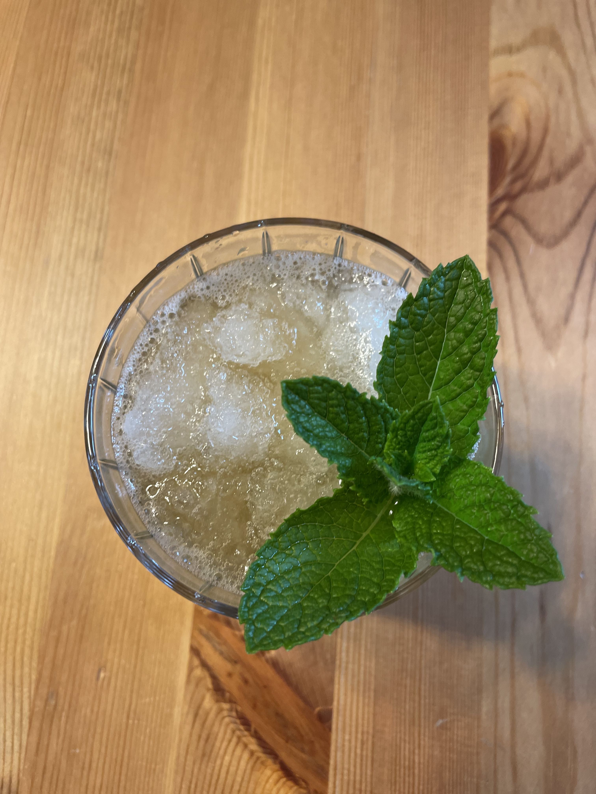

# Mint Julep 

A refreshing cocktail that is made from bourbon, simple syrup, crushed ice, and fresh mint. 

<figure markdown>
  { width="45%" align=left}
  { width="45%" }
</figure>

## Flavor Profile 

The bourbon profile comes out nicely so if you like bourbon, you probably will enjoy this summer drink. 

You can definitely smell and taste the sugary mint flavor. If you like mint teas, you probably will like this drink. 

## What Matters? 

1. A bunch of really really fresh mint! We are lucky to have mints in our backyard.
2. Ice! It is not easy to crush or shave ices. I saw people using knife for this step (but I did not dare to try), but if you have a blender, just pop in a few ice cubes and you should be all set.
3. A nice cocktail glass. We also tried the copper mug we used for Moscow Mule, but the copper mug is a bit too large for us to "pack it with ice".
4. Dash some bitter to complement the flavor. 

## My Ratings 

This drink is easy to make but is not for me. It lacks the flavor depth I like, in particular the richness in acidity and sweetness.
