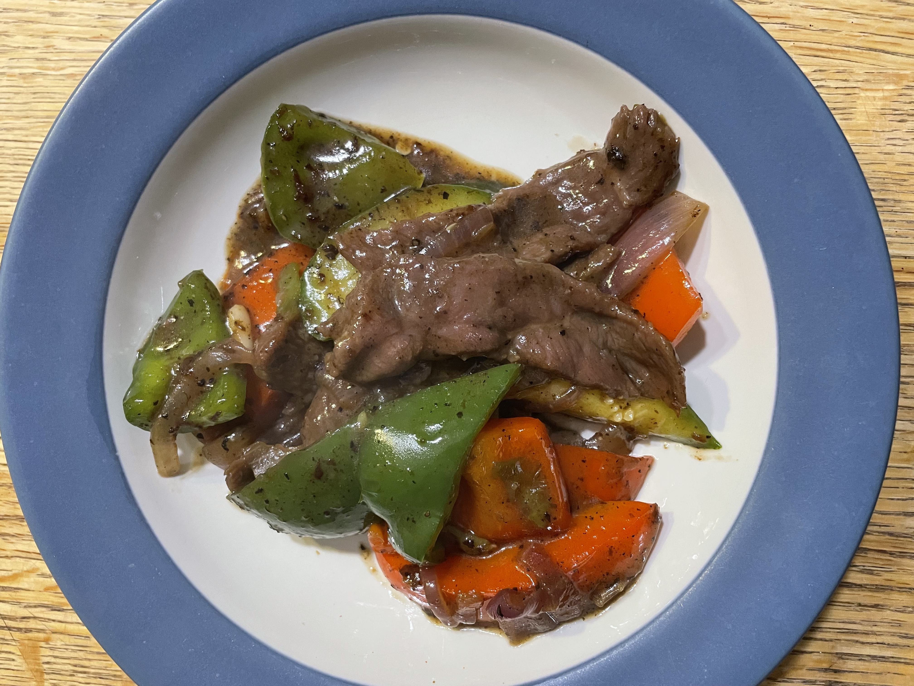

# Black Pepper Beef Stir 

This is one of my favorite dishes. It is very easy to make and works really well with most cut of beef.

<figure markdown>
  { width="45%" align=left}
</figure>

## Flavor Profile 

The most prominent flavor is black pepper in this dish. This is a mimic of the classic hot iron black pepper beef (铁板黑椒牛柳).
If you love the earthy smell and flavor of black pepper, this dish might be the one for you too! 

This dish has the nice aroma from the veggies, and the slight sweetness from the sauce. I usually do not like sweet and savory dishes, but there is just something about this dish that captures my taste buds. 

This is a nice all-year-around dish because the veggies that work well with this dish are super accessible all year around! 

## What Matters? 

1. The beef needs to be properly tenderized. I find that the easiest way is to spend $$$ to get a nice cut, chunk roast works surprisingly well. Sometimes I will even use the short rib. How you cut the meat also matters. Tries to cut against the grain. I use a combination of salt, oil, soy sauce, starch, and baking soda to marinate the meat for at least an hour---if you can do it overnight, then the beef will be both flavorful and tender.
2. Onions! I am not a huge fan of onions but I love onions with beef stir fry. You can try to cook without onions, but the dish will not taste as good. Onions also elevate the dish's smell too.
3. Temperature. You need to be able to get your wok to a very high temperature, so high that the vegetable oil starts to smoke. This allows the meat to cook fast and stay tender. If you don't have a non-stick wok, this can be tricky. The marinated meat might stick to the bottom of the wok, and the brown bits also burn very quickly. There are an easy way to mitigate this issue. Use a lot of oil! Because the high temperature, you can't really work away from the wok when you are cooking. 

