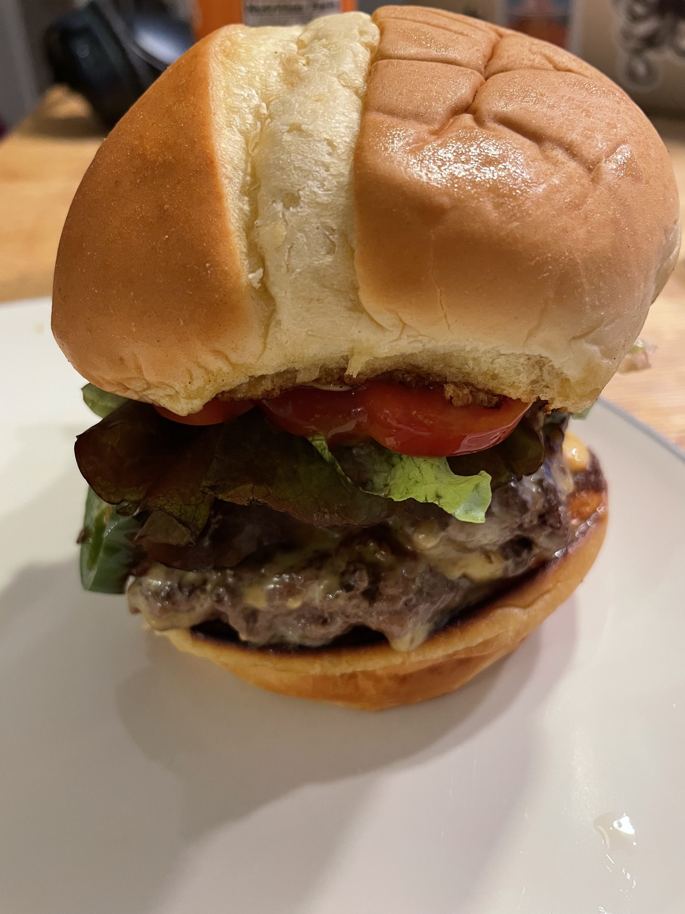
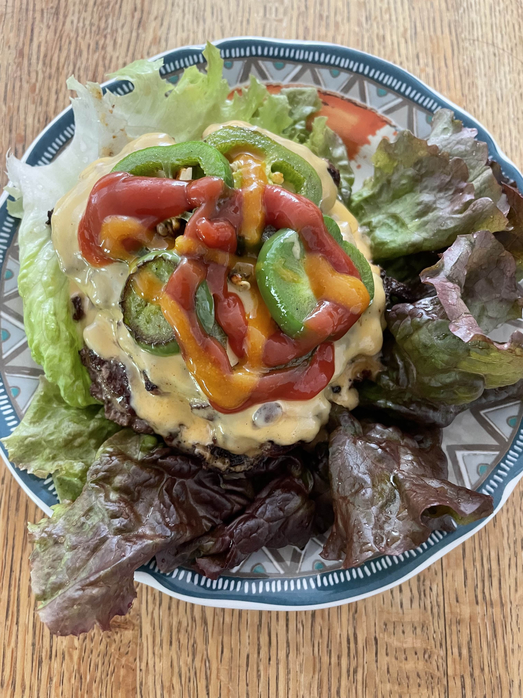

# Smash Burger

A post-workout guilty pleasure. 

I first had the smash burger in the Philly airport and it was amazing! 
It was a chicken smash burger with avocado and oh my, avocado makes everything tastes great. 

I love it so much that we have to recreate the recipe. Our smash burger uses the double beef patties (there is just no other way to make burger) and American cheese. 
The other key ingredient is jalapeño (learnt from Five guys). If you can't take heat, you need to take out the seeds and then grill it.  

If you want to go with a healthy version, replace the buns with lettuce wraps (yes that in-and-out burger trick). I had to try the lettuce wraps once but I have to admit, it just does not hit the spot.

<figure markdown>
  { width="45%" align=left}
  { width="45%" align=left}
</figure>

## Flavor Profile 

The most prominent flavor is the cheesy beef taste. Just like any good burgers. 

Our recipe has a good balance of acidity and sweetness, coming from the cherry tomato, jalapeño, ketchup, and habanero sauce. 

You have to eat it hot, both flavor wise and temperature wise, when the cheese is still running.

## What Matters? 

1. Get the grill to really really hot. This will give you the nice crisp on the patty.
2. You have to press down the beef patty firmly. This makes the patty larger in diameter and much thinner. I think this is also what the name "smash" comes from.
3. You absolutely need to add ketchup, no burger is complete with ketchup. 
4. If you are adventurous, you can also try the creamy habanero sauce, sweet and spicy!   
5. I used to think we need to use fancy buns for burger, but I realize fancy buns are just going to steal the glory of other ingredients. What we call 宣兵夺主 in Chinese. So just regular decent buns please.
